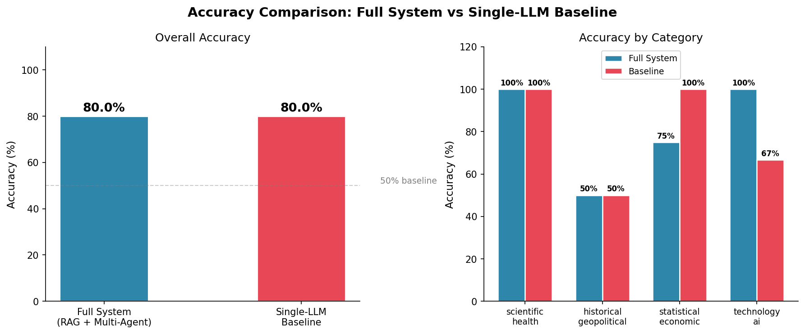
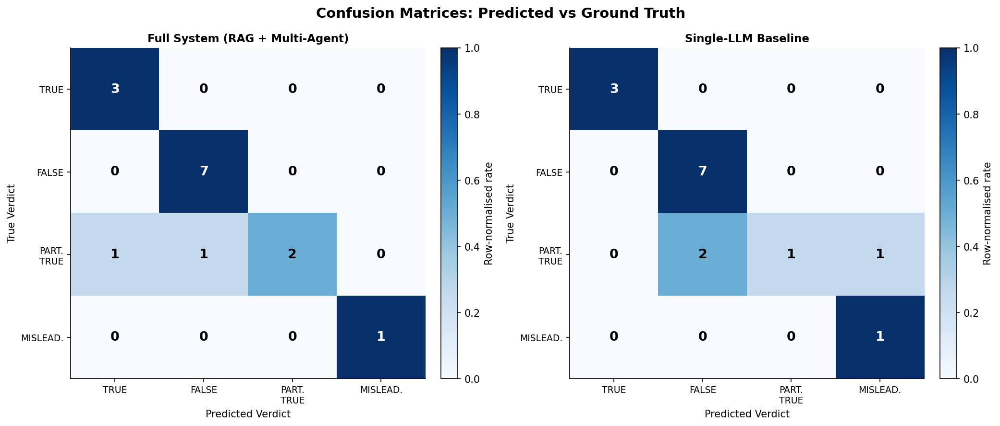
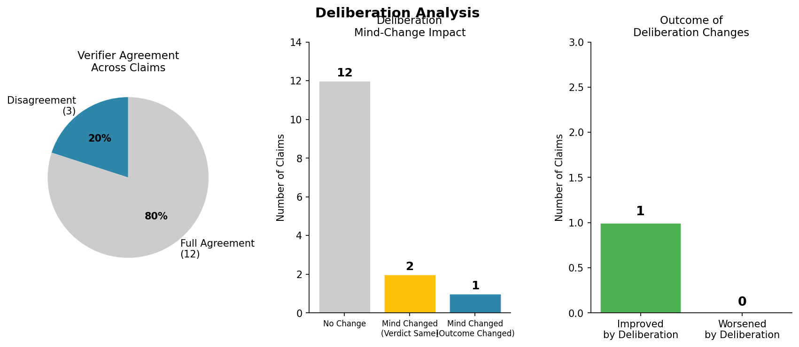
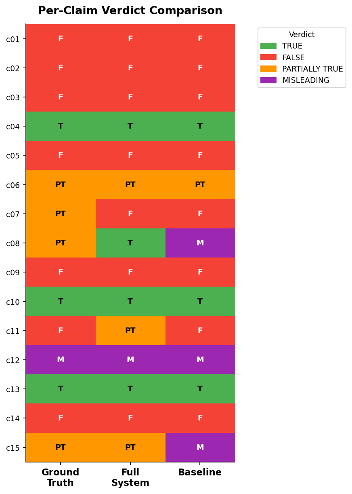
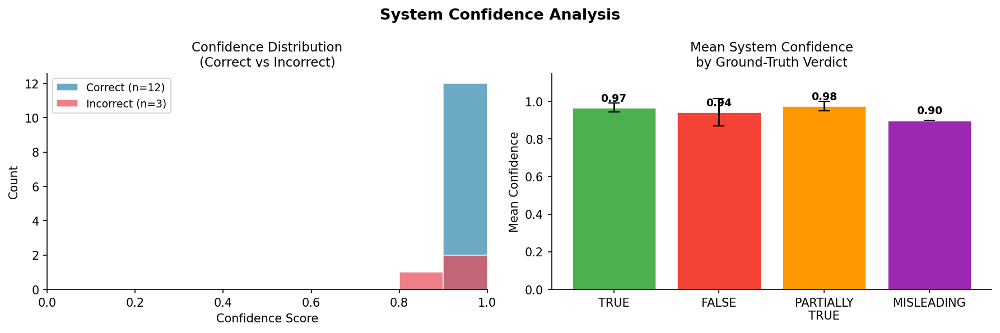

# Multi-LLM Claim Verification & Fact-Checking Pipeline
Ana Guruli
February 19, 2026

A production-quality, evidence-grounded, multi-agent fact-checking
system using **Google Gemini 2.5 Flash**. Complex claims are decomposed
into atomic sub-claims, verified against a RAG knowledge base by three
independent LLM verifiers with distinct personas, refined through
cross-agent deliberation, and synthesised into a final structured
ruling.

------------------------------------------------------------------------

## Results

**Final run --- 15 claims, 4 categories**

Metric                             Value
  ---------------------------------- -----------------------------------------
System Accuracy                    **86.7% (13/15)**
Baseline Accuracy                  80.0% (12/15)
Improvement over Baseline          +6.7%
Deliberation Change Rate           20.0% (3 claims triggered mind-changes)
Deliberation Outcome Change Rate   6.7% (1 claim outcome changed)

### Per-category breakdown

Category                    System   Baseline   n
  --------------------------- -------- ---------- ---
Scientific & Health         100%     100%       4
Historical & Geopolitical   50%      50%        4
Statistical & Economic      100%     100%       4
Technology & AI             100%     66.7%      3

The system's advantage over the baseline is clearest in **Technology &
AI**, where the baseline misclassified c15 (iPhone App Store / 3G claim)
as FALSE instead of PARTIALLY_TRUE --- the decomposition + retrieval
pipeline correctly separated the true sub-claim (2007 release) from the
two false ones (App Store, 3G).

The **Historical & Geopolitical** category was the hardest for both
systems (50%). See Error Analysis below.

------------------------------------------------------------------------

## Architecture

    Claim
      │
      ▼
    ┌──────────────────────┐
    │   Claim Decomposer   │  → Atomic sub-claims (Gemini 2.5 Flash, T=0.2)
    └──────────────────────┘
              │
              ▼
    ┌──────────────────────┐
    │  RAG Evidence        │  → FAISS cosine index
    │  Retriever           │    SentenceTransformers all-MiniLM-L6-v2
    │                      │    Top-4 passages per sub-claim
    └──────────────────────┘
              │
              ▼
    ┌────────────────────────────────────┐
    │  Independent Verifier Panel        │
    │  V1 — Conservative  (T=0.1)        │
    │  V2 — Balanced      (T=0.7)        │
    │  V3 — Systematic    (T=0.4)        │
    └────────────────────────────────────┘
              │
              ▼
    ┌──────────────────────┐
    │  Deliberation Engine │
    └──────────────────────┘
              │
              ▼
    ┌──────────────────────┐
    │  Synthesizer         │
    └──────────────────────┘
              │
              ▼
    ┌──────────────────────┐
    │  Single-LLM Baseline │
    └──────────────────────┘

------------------------------------------------------------------------

## Pipeline Stages

### Stage 1 --- Claim Decomposition

Breaks complex claims into independently verifiable atomic sub-claims
tagged by type.

### Stage 2 --- Evidence Retrieval (RAG)

FAISS index over 15 curated knowledge documents. Top-4 cosine-similar
passages retrieved per sub-claim.

### Stage 3 --- Independent Verification

Three verifier agents assess each sub-claim using different personas and
temperatures:

Verifier   Persona                   Temperature
  ---------- ------------------------- -------------
V1         Rigorous & conservative   0.1
V2         Balanced & contextual     0.7
V3         Systematic & structured   0.4

### Stage 4 --- Cross-Verification Deliberation

Triggered only on disagreement. Verifiers see peer reasoning and may
update verdicts.

### Stage 5 --- Final Synthesis

Produces final verdict (**TRUE / FALSE / PARTIALLY_TRUE / MISLEADING**)
with confidence and reasoning.

------------------------------------------------------------------------

## Project Structure

    multi-llm-claim-verification/
    ├── .env
    ├── config.py
    ├── main.py
    ├── requirements.txt
    ├── README.md
    │
    ├── data/
    │   ├── claims.py
    │   └── build_knowledge_base.py
    │
    ├── pipeline/
    │   ├── decomposer.py
    │   ├── retriever.py
    │   ├── verifier.py
    │   ├── deliberation.py
    │   ├── synthesizer.py
    │   └── baseline.py
    │
    ├── evaluation/
    │   ├── metrics.py
    │   └── visualizer.py
    │
    └── results/
        ├── full_results.json
        ├── evaluation_report.json
        └── plots/

------------------------------------------------------------------------

## Setup

### 1. Clone and install

``` bash
git clone https://github.com/anaguruli/multi-llm-claim-verification.git
cd multi-llm-claim-verification

python -m venv .venv
source .venv/bin/activate   # Windows: .venv\Scripts\activate

pip install -r requirements.txt
```

### 2. Configure API key

``` bash
cp .env.example .env
# Set GEMINI_API_KEY=your_key_here
```

### 3. Run the full pipeline

``` bash
python main.py
```

------------------------------------------------------------------------

## Configuration (config.py)

Parameter           Default
  ------------------- ---------------------
DECOMPOSER_MODEL    gemini-2.5-flash
VERIFIER_MODELS     gemini-2.5-flash ×3
SYNTHESIZER_MODEL   gemini-2.5-flash
BASELINE_MODEL      gemini-2.5-flash
CHUNK_SIZE          400
CHUNK_OVERLAP       80
TOP_K\_RETRIEVAL    4
EMBEDDING_MODEL     all-MiniLM-L6-v2

------------------------------------------------------------------------

## Error Analysis

Two misclassified claims (both Historical & Geopolitical):

### c07 --- China population & GDP

Decomposition granularity error. Sub-claims evaluated against current
facts, while ground truth considered historical framing.

### c08 --- Nelson Mandela / Robben Island

Decomposition coverage error. The implicit false implication was never
generated as a sub-claim.

------------------------------------------------------------------------

## Evaluation Plots

### Overall Accuracy Comparison


### Confusion Matrices


### Deliberation Statistics


### Verdict Heatmap


### Confidence Distribution



## Key Design Decisions

-   Verifier diversity via temperature + system prompts
-   Deliberation only on disagreement
-   FAISS cosine via normalised inner product
-   Native JSON mode throughout
-   Pre-deliberation verdict tracking

------------------------------------------------------------------------

## Requirements

-   Python 3.10+
-   Google Gemini API key (gemini-2.5-flash access)
-   \~500MB disk for embedding model cache
